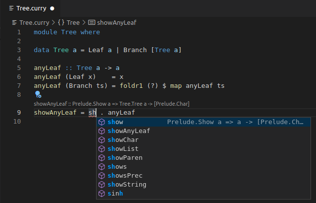

An experimental [language server](https://microsoft.github.io/language-server-protocol/) providing IDE support for the functional logic programming language [Curry](https://en.wikipedia.org/wiki/Curry_(programming_language)).

## Building
To build the language server, you will need the build tool [Haskell Stack](https://docs.haskellstack.org). Once installed, you can run `stack build` to build the language server.

The final executable will be located in `[path to dist dir]/build/curry-language-server` where the distribution directory can be found using `stack path --dist-dir`.

If you wish to use the language server in an editor, you can also use `stack install` to install the binary into `~/.local/bin`. By adding this directory to your `PATH`, invoking `curry-language-server` will work from any directory.

## Editor Integration
To use the language server, you will need an editor that supports LSP. This usually involves pointing the LSP client towards the built executable and setting the transport method to `stdio`.

For Visual Studio Code, [this extension](https://github.com/fwcd/vscode-curry) can be used.

## Known Issues
If the language server has trouble locating an interface for the `Prelude`, you may need to add the `curry-imports` directory to your config under the key `curry.languageServer.importPaths`. Alternatively, place a compiled version (`Prelude.icurry`) in the folder `[your project path]/.curry`.
